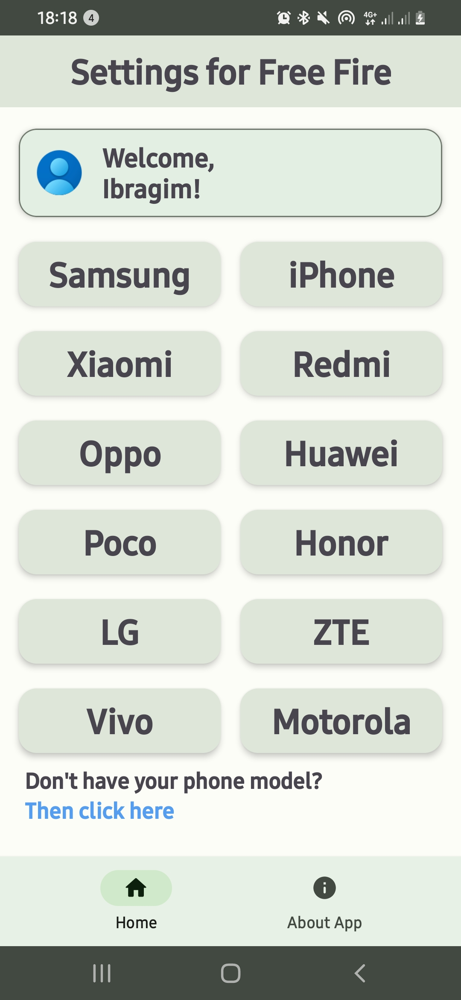
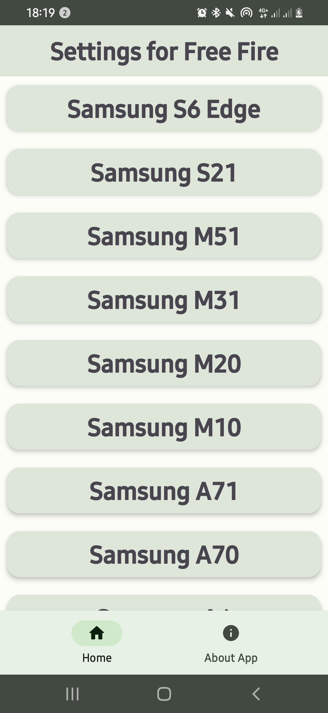

  <a href="https://play.google.com/store/apps/details?id=com.jvmfrog.ffsettings">
    
    <h1 align="center">Settings for Free Fire App</h1>
  </a>

  
  
  
  
  

___

## 🆕 Material You Design Settings for Free Fire App for Android

## ⚠ Join [@freefiresettingsapp](https://telegram.me/freefiresettingsapp) on Telegram for important updates.
___

## 📱 Screenshots
|  |  |  |
|:---:|:---:|:---:|
|Main Screen| Screen with mobile devices | Screen with settings display|

___

## 🧭 Navigation never made easier 
Self-explanatory interface without overloaded menus.

## 📦 Included Features
-  Cloudy - new settings appear without the need to update the app
-  Support for devices from 12 different manufacturers
-  A large number of settings for different mobile devices
-  Ability to request settings for your mobile device

We are trying our best to bring you the best user experience. The app is regularly being updated for bug fixes and new features.

___

## ❓ FAQ

In any case, you find or notice any bugs please report them by creating an issue or by contacting us in the [Telegram help & Feedback group](https://t.me/freefiresettingsapp_chat).

If you have any feature suggestions, please create an issue with detailed information or by contacting us in the [Telegram help & Feedback group](https://t.me/freefiresettingsapp_chat).

## 🔗 Social links
**Official Telegram channel:** https://t.me/jvmfrog  
**Official group in VK:** https://vk.com/jvmfrog  
**Telegram channel of the application:** https://t.me/freefiresettingsapp  
**Crowdin if you want to help with the translation of the application**: https://crwd.in/settings-for-free-fire-app  

## 🗂️ License

Settings for Free Fire App is released under the GNU General Public License v3.0
(GPLv3), which can be found [here](LICENSE.md)
> Internet connection required for first launch.
